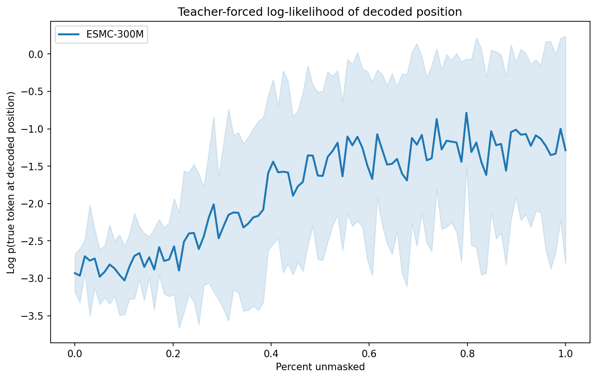

# Benchmarking Model Families: Generation Quality vs. Scale

??? abstract "Architecture Breakdown"
    **Data:** 20 random Swiss-Prot sequences (80–300 aa) as generation seeds + 1 shared decoding order per seed.

    **Models:** 6 pretrained generative models across 3 families (ESMC-300M/600M, ESM3-Open, DPLM2-150M/650M/3B) → [models](../reference/models.md). No predictive models or guidance — this benchmarks the base models directly.

    **Sampling:** `sample` (discrete-time ancestral) at 4 masking levels (10%, 25%, 50%, 100%) with controlled decoding orders → [sampling](../reference/sampling.md).

    **Evaluation:** Teacher-forced per-step decode log-likelihood, sequence identity to original, AF3 folding (pLDDT, pTM, TM-score) → [evaluation](../reference/evaluation.md). This is a pure evaluation example — no training or guidance.

How do different protein language model families compare when generating sequences, and does bigger always mean better?

We ran a controlled experiment generating proteins with **6 models across 3 families** (ESM-C, ESM3, DPLM-2) at 4 masking levels, evaluating sequence recovery and teacher-forced log-likelihood on 20 sequences. Structural metrics (pLDDT, TM-score) are from a prior run with 10 sequences × 5 orders, folded with AlphaFold 3.

## Experiment Setup

**Sequences**: 20 randomly sampled from Swiss-Prot (reviewed UniProt, 80–300 aa).

**Models** (3 families):

| Family | Model | Params |
|--------|-------|--------|
| ESM-C  | ESMC-300M | 300M |
| ESM-C  | ESMC-600M | 600M |
| ESM3   | ESM3-Open | 1.4B |
| DPLM-2 | DPLM2-150M | 150M |
| DPLM-2 | DPLM2-650M | 650M |
| DPLM-2 | DPLM2-3B  | 3B   |

**Masking levels**: 10%, 25%, 50%, 100% of positions masked.

**Controls**: 1 random decoding order per protein, generated up-front and shared across all models. For X% masking, the last X% of positions in each order are masked, and during generation positions are unmasked following that same order. This means differences between models at the same masking level and order are attributable to the model, not randomness in the mask pattern.

**Evaluation**: Each model is additionally scored with teacher forcing at every decode step, measuring log p(true token at the decoded position) vs. percent unmasked. Structural metrics (AF3 pLDDT, TM-score) come from a prior run (10 sequences × 5 orders, see [structural sections](#structural-quality-af3-plddt) below).

**Total**: 20 sequences × 1 order × 4 masking levels × 6 models = **480 generated sequences** (sequence recovery + teacher-forced likelihood), plus **1200 folded sequences** from the prior run (structural metrics).

## Results

### Sequence Recovery

How well do models reconstruct the original sequence at each masking level?


At 10% masking, all models achieve >91% sequence identity — filling in a few gaps is easy. The real separation happens at **50% masking**: ESMC-600M (75.3%) and ESMC-300M (73.6%) lead, followed by DPLM2-3B (67.9%). Smaller DPLM2 models and ESM3 lag behind: DPLM2-650M (59.8%), ESM3-Open (62.2%), DPLM2-150M (56.0%).

At 100% masking (fully unconditional generation), all models converge to ~6% identity — essentially random, as expected for a 20-letter alphabet.

### Teacher-Forced Decode Log-Likelihood Trajectories

How well does each model score the *true* residue at the position being decoded?

Instead of averaging log-probabilities of *sampled* tokens, this metric teacher-forces along one fixed decoding order per sequence: at each generation step we evaluate log p(true token at the decoded position), then plot those values against a normalized x-axis (percent unmasked). This isolates model quality from sampling luck.



The curves start around −3.0 (no context — all positions masked) and rise as context accumulates. Key observations:

- **ESMC-600M is the strongest model at every point along the curve**, reaching −1.0 by 80% unmasked
- **ESMC-300M is close behind**, confirming ESM-C's parameter efficiency
- **DPLM2-3B tracks ESMC well** in the first half of the curve but doesn't climb as steeply near the end, suggesting it uses context less efficiently at the residue level
- **ESM3-Open underperforms its size** (1.4B) — its trajectory sits below DPLM2-650M for most of the curve
- **DPLM2-150M is the weakest** throughout, with the flattest trajectory

The spread between models is widest in the middle of the curve (30–70% unmasked) where context-dependent predictions matter most. At the extremes (no context or full context), all models converge.

### Structural Quality (AF3 pLDDT)

Does higher sequence recovery translate to better-folding proteins?

> **Note**: The structural metrics below are from a prior benchmark run with 10 sequences × 5 orders (1200 samples). The sequence identity and teacher-forced trajectory results above use 20 sequences × 1 order (480 samples). The ranking between models is consistent across both runs.


At low masking, all models produce sequences with similar AF3 pLDDT (~50–52). As masking increases, **DPLM2-3B maintains structural quality best** (pLDDT 52→37), while smaller DPLM2 models degrade faster (50→34). ESM-C models hold up well in the middle range.

At 100% masking, all models produce low-confidence structures (pLDDT 34–39), but there's still a clear advantage for larger models.

### Fold Preservation (TM-score)

Do generated sequences fold into the same structure as the original?


TM-score to the original structure tells the structural similarity story:

- **10% masking**: ESM-C leads (TM-score ~0.58–0.60), followed by DPLM2-3B (0.52)
- **50% masking**: ESM-C (0.43–0.47) > DPLM2-3B (0.42) > ESM3 (0.41) > DPLM2-150M/650M (0.35–0.36)
- **100% masking**: All models ~0.24–0.26 (essentially unrelated structures)

## Scaling Analysis

### Within ESM-C (300M → 600M)

The 600M model consistently outperforms the 300M across all masking levels, but the improvement is modest: ~1% at 10% masking, ~2% at 50%. The teacher-forced trajectory shows a visible but small gap that grows slightly in the high-context regime.

### Within DPLM2 (150M → 650M → 3B)

DPLM2 shows **dramatic scaling benefits**:


- **Sequence identity at 50% masking**: 56% (150M) → 60% (650M) → **68% (3B)**
- **Mean step log-prob at 50%**: −2.62 (150M) → −2.32 (650M) → **−1.67 (3B)**
- **pLDDT at 50%**: 42 (150M) → 44 (650M) → **51 (3B)**

The jump from 650M to 3B is larger than 150M to 650M, suggesting DPLM2's scaling benefits are far from saturated.

### Cross-Family Comparison

Comparing models of similar size across families:

- **~300M range**: ESMC-300M (73.6% at 50% masking) clearly beats DPLM2-150M (56.0%)
- **~600M range**: ESMC-600M (75.3%) beats DPLM2-650M (59.8%), a 15-point gap suggesting ESM-C's architecture/training is far more sample-efficient
- **At the top**: DPLM2-3B (67.9%) approaches but doesn't match ESMC-300M (73.6%) despite being 10× larger

ESM3-Open (1.4B) occupies an interesting middle ground — its sequence recovery at 50% (62.2%) is between ESMC and DPLM2, and its teacher-forced trajectory is flatter than both ESMC models and DPLM2-3B. This likely reflects ESM3's multi-modal training objective diluting its sequence-only generation ability.

## Key Takeaways

1. **ESM-C is the most efficient generator per parameter**: ESMC-300M outperforms DPLM2-3B (a model 10× its size) on both sequence recovery and teacher-forced log-likelihood.

2. **DPLM2 scales aggressively**: The 3B model closes most of the gap to ESM-C. The scaling curve is steep enough that even larger DPLM2 models could potentially surpass ESM-C.

3. **Teacher-forced decode trajectories provide a cleaner likelihood diagnostic**: By scoring the true token at each decoded position rather than averaging over sampled tokens, this metric avoids conflating model quality with sampling noise and reveals how effectively each model uses partial context.

4. **Masking level is the dominant factor**: The difference between 10% and 100% masking dwarfs the difference between any two models. At 100% masking, all models produce essentially random sequences.

5. **ESM3 underperforms for unconditional generation**: Despite being 1.4B params, ESM3-Open's sequence recovery and likelihood trajectory lag behind ESMC-300M, likely because its multi-modal training (structure + function + sequence) distributes capacity across modalities.

6. **Structure quality tracks sequence recovery**: AF3 pLDDT and TM-score are strongly correlated with sequence identity. Models that better reconstruct the original sequence also produce more foldable proteins.

## Reproducing This Benchmark

### Prerequisites

For AF3 structural validation (optional), a running [AF3 inference server](https://github.com/ishan-gaur/af3-server) is needed. The client is included as a dependency of proteingen — just `uv sync`. See the [af3-server README](https://github.com/ishan-gaur/af3-server) for server setup.

```bash
# 1. Prepare data (sample from Swiss-Prot, generate orders)
uv run python examples/benchmark_model_families/prepare_data.py

# 2. Generate sequences (run per model for parallelism)
CUDA_VISIBLE_DEVICES=0 uv run python examples/benchmark_model_families/generate.py --model esmc_300m --device cuda
CUDA_VISIBLE_DEVICES=1 uv run python examples/benchmark_model_families/generate.py --model esm3-open --device cuda
# ... etc for all 6 models

# 3. Fold with AF3 (requires AF3 server running)
uv run python examples/benchmark_model_families/fold.py --server http://localhost:8080

# 4. Analyze and plot
uv run python examples/benchmark_model_families/analyze.py
```

See [`examples/benchmark_model_families/README.md`](https://github.com/ishan-gaur/proteingen/tree/main/examples/benchmark_model_families) for full details.
