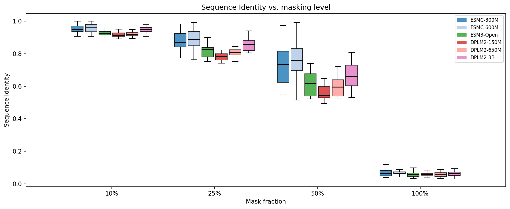
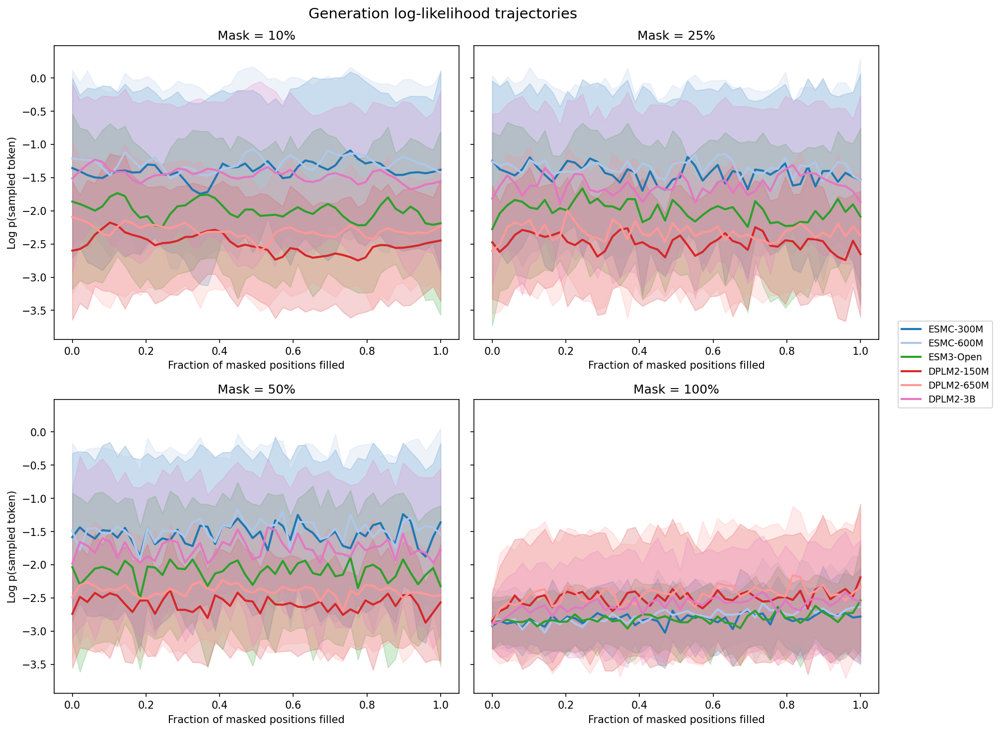
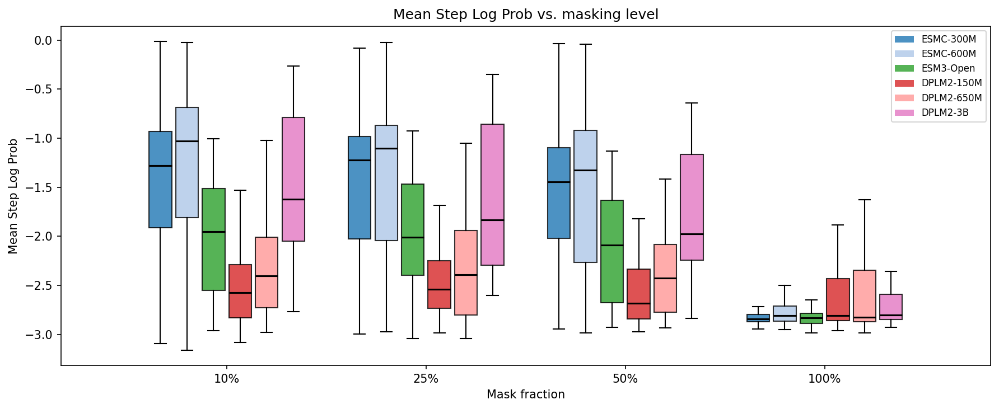
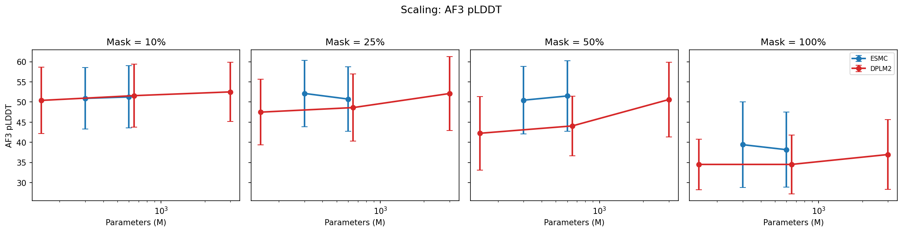
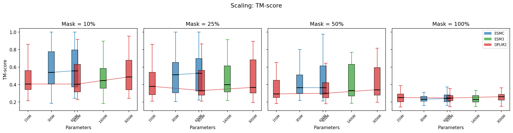
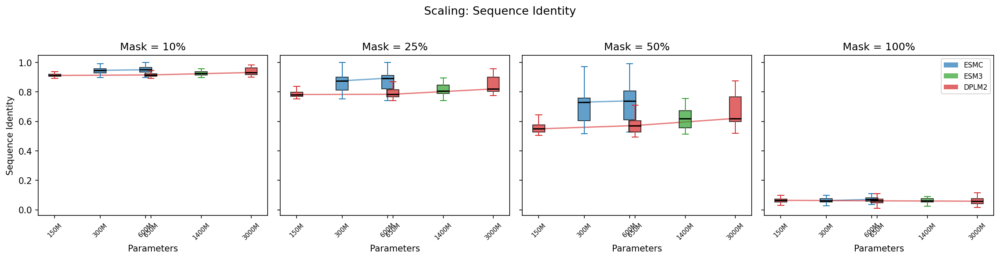
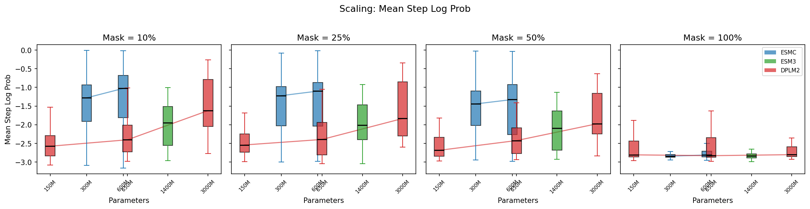

# Benchmarking Model Families: Generation Quality vs. Scale

How do different protein language model families compare when generating sequences, and does bigger always mean better?

We ran a controlled experiment generating proteins with **6 models across 3 families** (ESM-C, ESM3, DPLM-2) at 4 masking levels, then folded all 1200 generated sequences with AlphaFold 3.

## Experiment Setup

**Sequences**: 10 randomly sampled from Swiss-Prot (reviewed UniProt, 80–300 aa).

**Models** (3 families):

| Family | Model | Params |
|--------|-------|--------|
| ESM-C  | ESMC-300M | 300M |
| ESM-C  | ESMC-600M | 600M |
| ESM3   | ESM3-Open | 1.4B |
| DPLM-2 | DPLM2-150M | 150M |
| DPLM-2 | DPLM2-650M | 650M |
| DPLM-2 | DPLM2-3B  | 3B   |

**Masking levels**: 10%, 25%, 50%, 100% of positions masked.

**Controls**: 5 random decoding orders per protein, generated up-front and shared across all models. For X% masking, the last X% of positions in each order are masked, and during generation positions are unmasked following that same order. This means differences between models at the same masking level and order are attributable to the model, not randomness in the mask pattern.

**Evaluation**: Each generated sequence was folded with AlphaFold 3. Metrics include sequence identity to original, per-step generation log-likelihood, AF3 pLDDT, pTM, and TM-score to the original structure.

**Total**: 10 sequences × 5 orders × 4 masking levels × 6 models = **1200 generated sequences**, all folded with AF3.

## Results

### Sequence Recovery

How well do models reconstruct the original sequence at each masking level?



At low masking (10%), all models achieve >90% sequence identity — they're good at filling in a few gaps. The real separation happens at **50% masking**: ESM-C models (71–73%) and DPLM2-3B (66%) lead, while smaller DPLM2 models and ESM3 lag behind (56–62%).

At 100% masking (fully unconditional generation), all models converge to ~6% identity — essentially random, as expected.

### Generation Log-Likelihood Trajectories

How confident is each model at each step of the generation process?



**ESM-C models are the most confident generators**, with mean step log-probs around -1.3 to -1.5 across all masking levels (except 100%). DPLM2-3B is comparable. Smaller DPLM2 models are notably less confident (around -2.3 to -2.5).

An interesting pattern: at 100% masking, all models produce similar mean log-probs (~-2.5 to -2.8), but the trajectories look qualitatively different — ESM-C trajectories are smoother while DPLM2 trajectories show more variance.



### Structural Quality (AF3 pLDDT)

Does higher sequence recovery translate to better-folding proteins?



At low masking, all models produce sequences with similar AF3 pLDDT (~50–52). As masking increases, **DPLM2-3B maintains structural quality best** (pLDDT 52→37), while smaller DPLM2 models degrade faster (50→34). ESM-C models hold up well in the middle range.

At 100% masking, all models produce low-confidence structures (pLDDT 34–39), but there's still a clear advantage for larger models.

### Fold Preservation (TM-score)

Do generated sequences fold into the same structure as the original?



TM-score to the original structure tells the structural similarity story:

- **10% masking**: ESM-C leads (TM-score ~0.58–0.60), followed by DPLM2-3B (0.52)
- **50% masking**: ESM-C (0.43–0.47) > DPLM2-3B (0.42) > ESM3 (0.41) > DPLM2-150M/650M (0.35–0.36)
- **100% masking**: All models ~0.24–0.26 (essentially unrelated structures)

## Scaling Analysis

### Within ESM-C (300M → 600M)

The 600M model consistently outperforms the 300M across all metrics and masking levels, but the improvement is modest (~1–3% in sequence identity, ~0.02 in TM-score). The scaling benefit is most visible at 50% masking.

### Within DPLM2 (150M → 650M → 3B)

DPLM2 shows **dramatic scaling benefits**:



- **Sequence identity at 50%**: 56% (150M) → 58% (650M) → **66% (3B)**
- **pLDDT at 50%**: 42 (150M) → 44 (650M) → **51 (3B)**
- **Generation confidence**: The 3B model's mean log-prob (-1.5) is much closer to ESM-C than to the smaller DPLM2 models (-2.3 to -2.5)

The jump from 650M to 3B is particularly striking — it's a larger improvement than 150M to 650M despite a similar relative parameter increase.



### Cross-Family Comparison

Comparing models of similar size across families:

- **~300M range**: ESMC-300M clearly beats DPLM2-150M in both sequence recovery and structural quality
- **~600M range**: ESMC-600M beats DPLM2-650M, suggesting ESM-C's architecture/training is more sample-efficient
- **At the top**: DPLM2-3B approaches ESM-C performance for sequence identity but generates with notably higher confidence (log-prob -1.5 vs -1.3)

ESM3-Open (1.4B) occupies an interesting middle ground — its sequence recovery is between ESMC and DPLM2 at moderate masking, but its generation confidence is lower than ESM-C despite being larger.

## Key Takeaways

1. **ESM-C is the most efficient generator per parameter**: At 300M and 600M params, it outperforms similarly-sized DPLM2 models on all metrics.

2. **DPLM2 scales aggressively**: The 3B model closes most of the gap to ESM-C, and the scaling curve suggests even larger DPLM2 models could surpass it.

3. **ESM3 underperforms for unconditional generation**: Despite being 1.4B params, ESM3-Open generates less confidently than ESMC-300M. This likely reflects its multi-modal training — ESM3 was trained to model structure, function, and sequence jointly, which may dilute its sequence-only generation ability.

4. **Masking level is the dominant factor**: The difference between 10% and 100% masking dwarfs the difference between any two models. At 100% masking, all models produce essentially random sequences with poor structural quality.

5. **Structure quality tracks sequence recovery**: AF3 pLDDT and TM-score are strongly correlated with sequence identity. Models that better reconstruct the original sequence also produce more foldable proteins.

## Reproducing This Benchmark

### Prerequisites

Step 3 requires a running [AF3 inference server](https://github.com/ishan-gaur/af3-server). The client is included as a dependency of proteingen — just `uv sync`. See the [af3-server README](https://github.com/ishan-gaur/af3-server) for server setup.

```bash
# 1. Prepare data (sample from Swiss-Prot, generate orders)
uv run python examples/benchmark_model_families/prepare_data.py

# 2. Generate sequences (run per model for parallelism)
CUDA_VISIBLE_DEVICES=0 uv run python examples/benchmark_model_families/generate.py --model esmc_300m --device cuda
CUDA_VISIBLE_DEVICES=1 uv run python examples/benchmark_model_families/generate.py --model esm3-open --device cuda
# ... etc for all 6 models

# 3. Fold with AF3 (requires AF3 server running)
uv run python examples/benchmark_model_families/fold.py --server http://localhost:8080

# 4. Analyze and plot
uv run python examples/benchmark_model_families/analyze.py
```

See [`examples/benchmark_model_families/README.md`](https://github.com/ishan-gaur/proteingen/tree/main/examples/benchmark_model_families) for full details.
