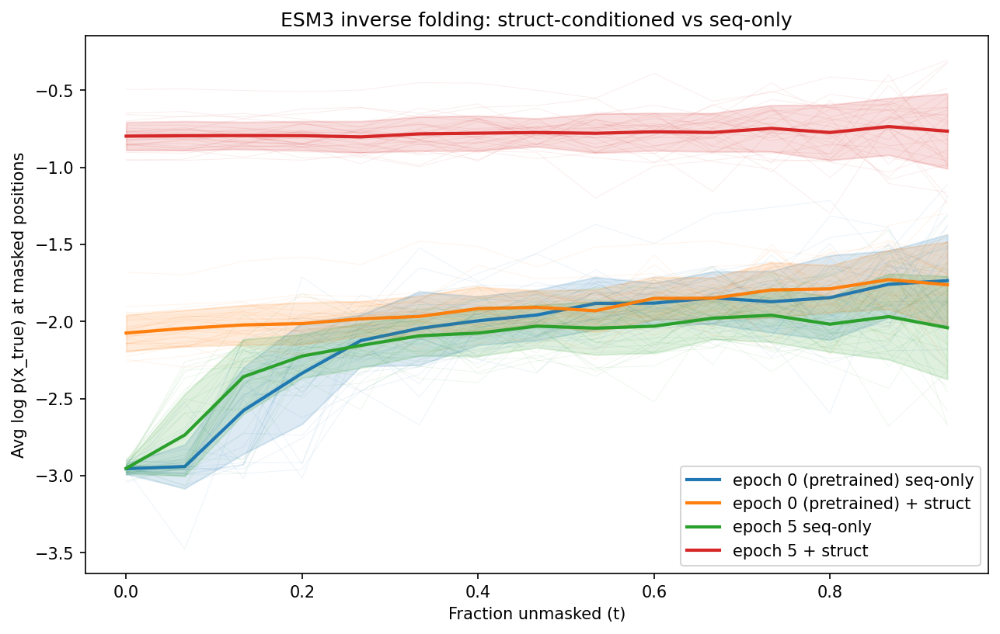

# Fine-tuning ESM3 as Inverse Folding Model (EphB1)

??? abstract "Architecture Breakdown"
    **Data:** ~9.2k EphB1 homologs with AF3-predicted structures. The pipeline: MSA → gap stripping → AF3 folding → atom37 coords + VQ-VAE structure tokens → [MSA → Dataset](../workflows/msa-to-dataset.md). Custom collator pads both sequences and structures per batch.

    **Models:** ESM3 with LoRA (r=4), structure-conditioned — all sequence positions masked, model predicts from structure alone → [generative_modeling](../reference/generative_modeling.md). This is an instance of the [Fine-tuning](../workflows/finetune-generative.md) module (inverse folding variant).

    **Sampling:** None (training only).

    **Evaluation:** Per-epoch likelihood curves comparing structure-conditioned vs. sequence-only prediction → [Likelihood Curves](../workflows/likelihood-curves.md). Key metric: structure-conditioned log-prob at t=0 (fully masked).

The full pipeline: fold MSA sequences with AF3, then fine-tune ESM3 to predict sequence from structure.

## Prerequisites

### AF3 Server

Step 1 requires a running [AF3 inference server](https://github.com/ishan-gaur/af3-server). Install the client package:

```bash
# From the proteingen repo — already listed as a dev dependency
uv sync

# Or install standalone
uv pip install git+https://github.com/ishan-gaur/af3-server.git
```

Then start the server on a GPU node (see the [af3-server README](https://github.com/ishan-gaur/af3-server) for full setup):

```bash
cd /path/to/af3-server
sbatch launch.sh
# Wait for "Server ready." in the SLURM log
```

## Step 1: Fold MSA sequences

```bash
# Fold all sequences (runs ~80h for 10k sequences, saves incrementally)
uv run python examples/finetune_esm3/fold_msa_domains.py \
    --server-url http://localhost:8080
```

## Step 2: Train inverse folding model

```bash
uv run python examples/finetune_esm3/finetune_inverse_folding.py \
    --device cuda --amp --epochs 5
```

## Results

Evaluates both structure-conditioned and sequence-only likelihood curves at each epoch. Results on ~9.2k EphB1 structures:

| Epoch | Loss  | PPL  | Struct log p (t=0) | Seq-only log p (t=0) |
|-------|-------|------|--------------------|---------------------|
| 0     | —     | —    | -2.075             | -2.955              |
| 5     | 0.572 | 1.77 | -0.798             | -2.953              |

The structure-conditioned model improves from -2.075 to -0.798 while sequence-only stays flat at -2.95, confirming the model learns to use structure information.



See the [Fine-tuning workflow](../workflows/finetune-generative.md) and [MSA → Dataset workflow](../workflows/msa-to-dataset.md) for the full walkthrough.

**Source**: [`examples/finetune_esm3/`](https://github.com/ishan-gaur/proteingen/blob/main/examples/finetune_esm3/)
