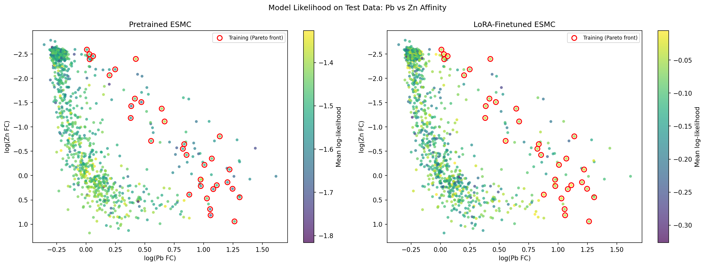
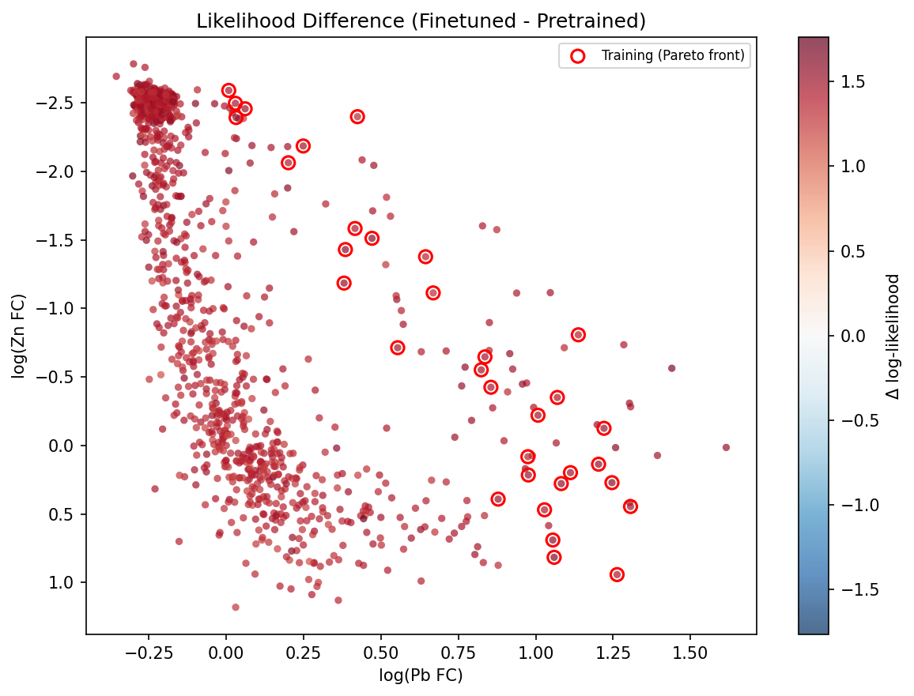
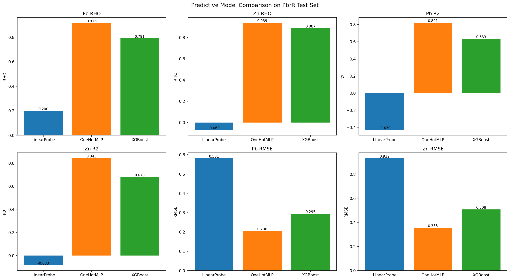
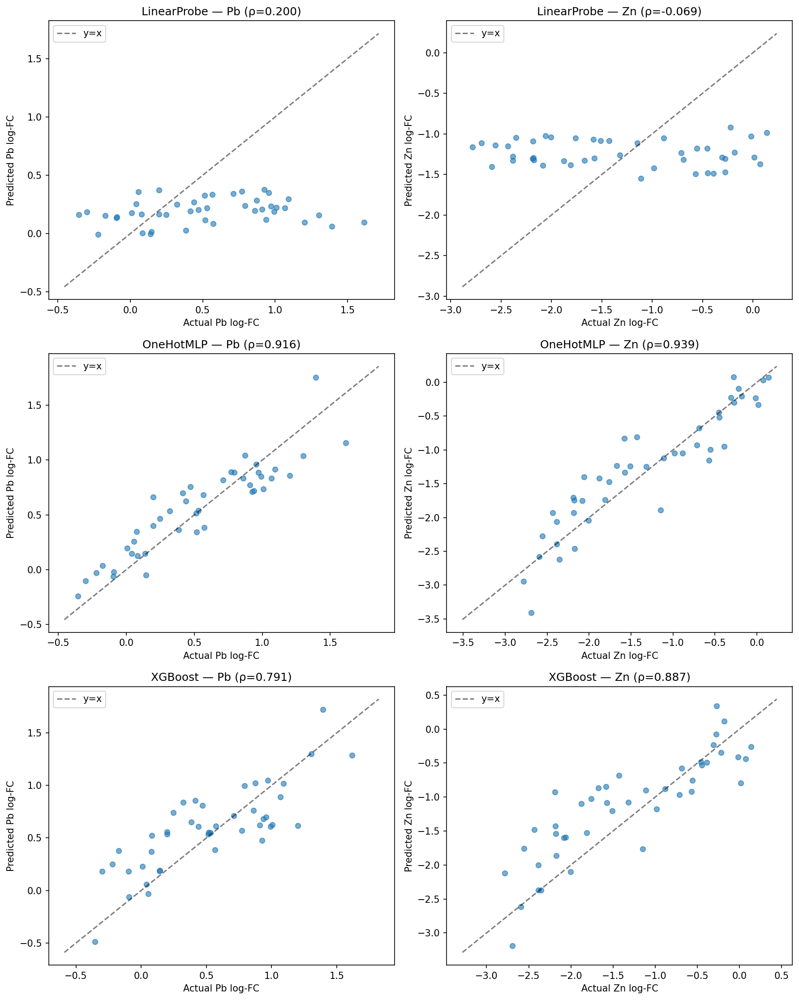
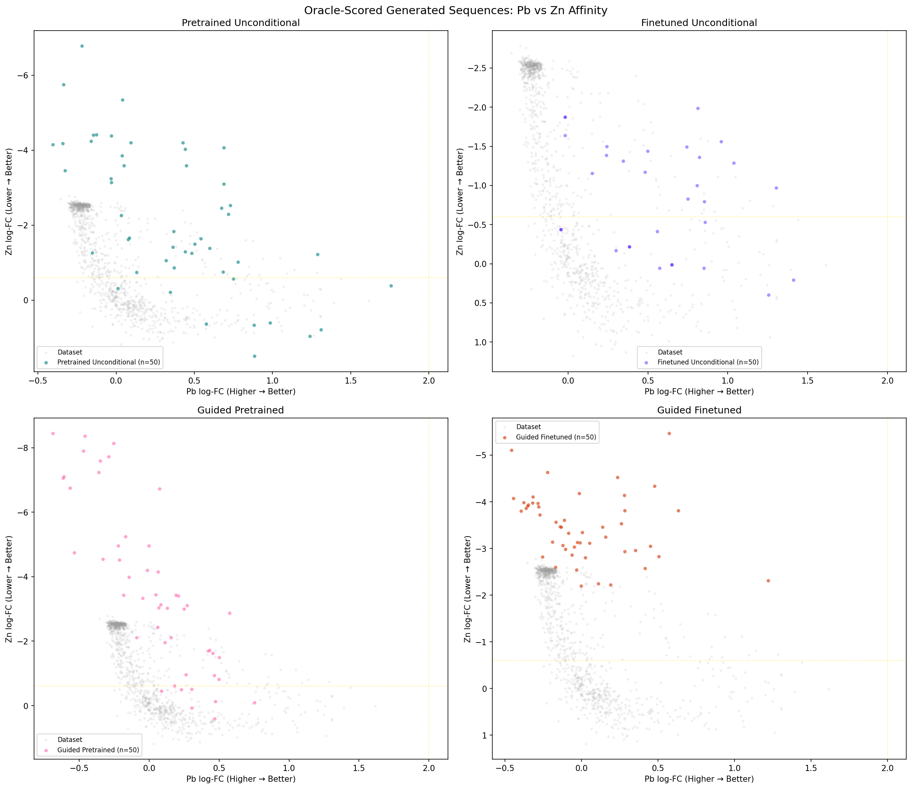
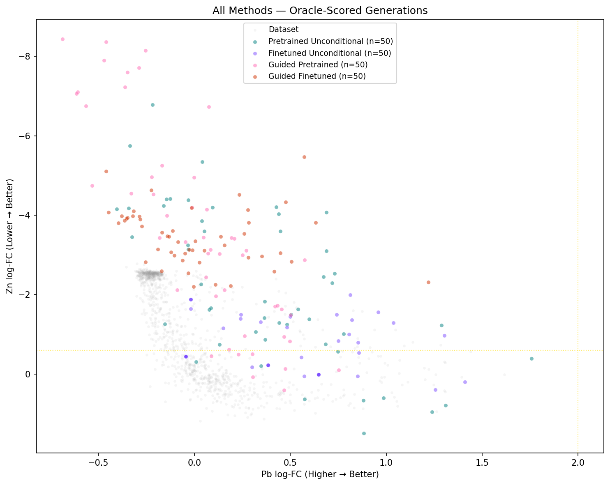

# PbrR Guided Design Walkthrough

A complete, end-to-end walkthrough of guided protein design applied to PbrR, a lead-sensing transcription factor. This example extends the experiment from [*"Active learning-guided optimization of cell-free biosensors for lead testing in drinking water"*](https://www.nature.com/articles/s41467-025-66964-6) (Nature Communications, 2025) through three steps:

1. **LoRA fine-tune** ESMC on Pareto-front variants
2. **Train and compare** three predictive model architectures
3. **Guided generation** combining fine-tuned generative models with trained classifiers

The goal is to engineer PbrR variants that are highly sensitive to lead (Pb) while being insensitive to zinc (Zn) — a multi-objective optimization problem.

!!! info "Data requirements"
    This walkthrough uses the PbrR experimental data from the paper:

    - **Round 1 CSV** — 1,099 variants with Pb/Zn fold-change measurements
    - **Supplementary source data** — ~2,024 variants across all experimental rounds (downloaded from the [Nature paper supplements](https://static-content.springer.com/esm/art%3A10.1038%2Fs41467-025-66964-6/MediaObjects/41467_2025_66964_MOESM6_ESM.xlsx))

---

## Background

PbrR is a transcription factor that naturally responds to lead ions. In the wild type, lead binding activates transcription while zinc also triggers a response — making it non-selective. The engineering goal is to increase Pb sensitivity (high fold-change) while decreasing Zn response (low fold-change).

The original discrete guidance experiment used:

- **ESMC-300M** as the generative model (masked language model)
- A **kernel ridge regression** predictor for Bayesian guidance
- **Site-saturation mutagenesis (SSM) positions** — 49 positions where experimental mutations exist — as the mask pattern for generation

This walkthrough reproduces and extends that pipeline using the ProteinGen library.

---

## Step 1: LoRA Fine-tune ESMC on Pareto Front

The first step fine-tunes ESMC-300M using LoRA adapters on the 33 "successful" training variants — those on the Pareto front where lead sensitivity is high and zinc response is low.

### Why fine-tune?

The pretrained ESMC has a prior over natural protein sequences, but knows nothing about what makes a PbrR variant successful. By fine-tuning on Pareto-front variants, the model shifts its probability mass toward sequences that resemble successful designs. This creates a better base model for both unconditional generation and guided sampling.

### Running

```bash
uv run python examples/pbrr_walkthrough/step1_finetune_esmc.py \
    --epochs 100 --lora-rank 16 --device cuda
```

### LoRA configuration

We apply LoRA to the attention and sequence head layers:

```python
lora_targets = [
    "attn.layernorm_qkv.1",  # attention QKV projection (30 blocks)
    "attn.out_proj",          # attention output projection (30 blocks)
    "sequence_head.0",        # first head layer
    "sequence_head.3",        # final head layer
]
model.apply_lora(target_modules=lora_targets, r=16, lora_alpha=32)
```

This gives **2.8M trainable parameters** out of 335M total (0.84%), enough to shift the model's distribution without overfitting on just 33 sequences.

### Training

The model is trained with masked language modeling: at each step, a random fraction of positions are masked and the model predicts the true amino acid from context. Loss is computed only on masked positions:

```python
# Loss on masked positions only
mask = noisy_seqs != true_seqs
loss = -(target_lp * mask).sum(dim=1) / mask.sum(dim=1).clamp(min=1)
```

Training converges quickly on this tiny dataset:

| Epoch | Loss  |
|-------|-------|
| 1     | 1.71  |
| 10    | 0.13  |
| 20    | 0.05  |
| 100   | 0.03  |

### Results: Likelihood comparison

After training, we compute pseudo-log-likelihoods for all 1,099 variants under both the pretrained and fine-tuned models. Each sequence is masked at ~50% of positions 5 times, and the average log p(true token | masked context) is recorded.


*Left: pretrained ESMC likelihoods (LL range: −1.8 to −1.3). Right: fine-tuned ESMC likelihoods (LL range: −0.30 to −0.05). Red circles mark the 33 Pareto-front training variants. The fine-tuned model assigns uniformly higher likelihood to all variants, with the strongest increase for sequences similar to the training set.*

The likelihood difference plot shows where fine-tuning helped most:


*Δ log-likelihood (finetuned − pretrained) for all variants. All points are red (positive), showing the fine-tuned model assigns higher likelihood everywhere. The increase is relatively uniform, with a slight uplift in the Pareto-front region (upper-left: high Pb, low Zn).*

**Summary statistics:**

| Region | Pretrained LL | Finetuned LL | Δ |
|--------|--------------|-------------|---|
| Success (Pareto front) | −1.55 | −0.09 | **+1.45** |
| Non-success | −1.49 | −0.11 | **+1.38** |

The fine-tuned model shows a modest but consistent preference for Pareto-front sequences (+1.45 vs +1.38).

---

## Step 2: Train and Compare Predictive Models

The second step trains three different predictive model architectures on the round 1 data and evaluates them on the held-out test set. The test set uses the same split as the original paper — a random half of the multi-mutant variants.

### Models

=== "Linear Probe"
    Frozen ESMC-300M embeddings → mean-pooled → linear head predicting [Pb log-FC, Zn log-FC].

    ```python
    class PbrRLinearProbe(LinearProbe):
        def __init__(self):
            super().__init__(embed_model=ESMC("esmc_300m"), output_dim=2)
    ```

    Requires pre-computing embeddings (one-time cost), then training is fast — ~200 epochs on a linear head.

=== "OneHotMLP"
    Full-vocabulary one-hot encoding → 2-layer MLP (256 hidden, ReLU, dropout 0.1) → 2 outputs.

    ```python
    class PbrROneHotMLP(OneHotMLP):
        def __init__(self):
            super().__init__(
                tokenizer=EsmSequenceTokenizer(),
                sequence_length=147,  # PbrR length + BOS/EOS
                model_dim=256, n_layers=2, output_dim=2,
            )
    ```

    No pretrained knowledge, but can learn position-specific mutation effects directly from the one-hot encoding.

=== "XGBoost"
    Gradient-boosted trees on flattened one-hot features. Uses the new `XGBoostPredictor` class added to `proteingen.models`.

    ```python
    class PbrRXGBoost(XGBoostPredictor):
        def __init__(self):
            super().__init__(
                tokenizer=EsmSequenceTokenizer(),
                output_dim=2,
                n_estimators=500, max_depth=6,
            )
    ```

    Non-differentiable (TAG won't work), but compatible with DEG guidance.

### Running

```bash
uv run python examples/pbrr_walkthrough/step2_train_predictors.py \
    --device cuda --probe-epochs 200 --mlp-epochs 300
```

### Results


*Bar charts comparing all three models across six metrics (Spearman ρ, R², RMSE for both Pb and Zn). The OneHotMLP dominates across all metrics, followed by XGBoost, with the LinearProbe performing poorly.*

| Model | Pb ρ | Zn ρ | Pb R² | Zn R² | Pb RMSE | Zn RMSE |
|-------|------|------|-------|-------|---------|---------|
| **LinearProbe** | 0.200 | −0.069 | −0.430 | −0.083 | 0.581 | 0.932 |
| **OneHotMLP** | **0.916** | **0.939** | **0.821** | **0.843** | **0.206** | **0.355** |
| **XGBoost** | 0.791 | 0.887 | 0.633 | 0.678 | 0.295 | 0.508 |

The **OneHotMLP** is the best model overall (average ρ = 0.93), outperforming XGBoost (ρ = 0.84) and dramatically outperforming the LinearProbe (ρ = 0.07).


*Predicted vs actual log fold-change for each model (Pb left, Zn right). The OneHotMLP (middle row) shows tight correlation along the diagonal for both targets. The LinearProbe (top) fails to capture the range of variation. XGBoost (bottom) shows good correlation but more spread than the MLP.*

!!! note "Why does the LinearProbe fail?"
    The PbrR dataset has only ~1,100 sequences and the mutations are sparse (most variants differ from WT at just 1–3 positions out of 145). ESMC's pretrained embeddings capture general protein structure but may not be sensitive to the specific single-residue mutations that drive Pb/Zn selectivity. The OHE models directly see which positions are mutated and to what residue — exactly the signal that matters here.

---

## Step 3: Guided Generation and Comparison

The final step brings everything together: an oracle for evaluation, a noisy classifier for guidance, and four generation methods to compare.

### 3a. Train the oracle on all data

An XGBoost model is trained on all ~2,024 variants from all experimental rounds (round 1 + later rounds from the paper's supplementary data). This serves as a surrogate ground truth for evaluating generated sequences.

```bash
uv run python examples/pbrr_walkthrough/step3_guided_generation.py \
    --device cuda --oracle-type xgboost --n-sequences 50
```

Oracle quality on all data:

| Metal | Spearman ρ | RMSE |
|-------|-----------|------|
| Pb | 0.940 | 0.119 |
| Zn | 0.941 | 0.390 |

### 3b. Train a noisy classifier for DEG guidance

A noisy classifier is trained on the full round 1 dataset (1,099 sequences) with **random masking** at each training step. This is critical: during generation, the classifier sees partially-masked sequences, so it must be robust to missing information.

The classifier is an OHE MLP that predicts [Pb log-FC, Zn log-FC], then converts to a binary "success" logit via:

```python
# Success = high Pb AND low Zn
pb_logit = k * (pb_pred - pb_threshold)
zn_logit = k * (zn_threshold - zn_pred)
joint_logit = pb_logit + zn_logit  # approximate AND
```

This is used with **DEG (Discrete Enumeration Guidance)**: at each unmasking step, DEG tries every possible amino acid at the chosen position and reweights based on the classifier's success probability.

### 3c. Generate and compare four methods

Each method generates 50 sequences by iterative unmasking from the wild-type PbrR template with SSM positions masked (49 out of 145 positions):

1. **Pretrained unconditional** — base ESMC-300M, no guidance
2. **Finetuned unconditional** — LoRA-adapted ESMC from Step 1
3. **DEG-guided pretrained** — base ESMC + noisy classifier guidance
4. **DEG-guided finetuned** — LoRA ESMC + noisy classifier guidance

### Results


*Oracle-scored generated sequences for each method (colored) overlaid on the round 1 dataset (gray). Target region: Pb log-FC ≥ 2.0 (rightward), Zn log-FC ≤ −0.6 (upward). Yellow lines mark the target thresholds.*

Key observations from the oracle-scored scatter plots:

- **Pretrained unconditional** (teal, top-left): generates diverse sequences spanning a wide range, including some with very low Zn but modest Pb
- **Finetuned unconditional** (purple, top-right): the distribution shifts toward the Pareto front — sequences cluster near the successful region with higher Pb and lower Zn than pretrained
- **Guided pretrained** (pink, bottom-left): guidance pushes Zn very low (most sequences below −2 log-FC) but doesn't push Pb high enough on its own
- **Guided finetuned** (red, bottom-right): combines both effects — guidance pushes toward low Zn while finetuning provides a better starting distribution


*All four methods overlaid. The guided methods (pink, red) produce the lowest Zn scores, while the finetuned methods (purple, red) shift Pb rightward toward higher sensitivity.*

### Summary statistics

| Method | Mean Pb logFC | Mean Zn logFC | Max Pb | Min Zn |
|--------|-------------|-------------|--------|--------|
| Pretrained Unconditional | 0.37 | −2.21 | 1.76 | −6.78 |
| Finetuned Unconditional | 0.40 | −0.69 | 1.41 | −1.99 |
| Guided Pretrained | 0.03 | −3.59 | 0.75 | −8.44 |
| Guided Finetuned | 0.01 | −3.46 | 1.22 | −5.46 |

!!! tip "Interpreting the results"
    The target thresholds (Pb log-FC ≥ 2.0, Zn log-FC ≤ −0.6) correspond to fold-changes of Pb ≥ 7.4× and Zn ≤ 0.55×. These are very stringent targets that only a handful of the 2,024 known experimental variants achieve. With only 50 generated sequences per method, we don't expect to hit this exact target region. What we do see is that guidance shifts the distribution in the correct direction: lower Zn log-FC (more zinc-insensitive) compared to unconditional sampling.

    To improve hit rates, consider: generating more sequences (500–1000), tuning the classifier temperature (`--guidance-temp`), using a lower Pb threshold, or training a stronger classifier with more epochs.

---

## Library feature: XGBoostPredictor

This walkthrough introduces `XGBoostPredictor` as a new base class in `proteingen.models`. It wraps XGBoost regressors/classifiers into the PredictiveModel framework:

```python
from proteingen.models import XGBoostPredictor
from proteingen.predictive_modeling import point_estimate_binary_logits

class MyPredictor(XGBoostPredictor):
    def __init__(self):
        super().__init__(tokenizer=my_tokenizer, output_dim=2)

    def format_raw_to_logits(self, raw_output, ohe_seq_SPT, **kwargs):
        return point_estimate_binary_logits(raw_output[:, 0], self.target)

predictor = MyPredictor()
predictor.fit(train_ohe, train_labels)  # train on flattened OHE features
predictions = predictor.predict(token_ids)  # predict from token IDs
```

Key properties:

- Compatible with **DEG** guidance (enumeration-based)
- **Not** compatible with TAG (XGBoost is non-differentiable)
- Multi-output support (trains separate models per output dimension)
- Save/load via `save_model()` / `load_model()`

---

## Running the full pipeline

```bash
# Step 1: Fine-tune ESMC on Pareto front (≈5 min on GPU)
uv run python examples/pbrr_walkthrough/step1_finetune_esmc.py \
    --epochs 100 --device cuda

# Step 2: Compare predictive models (≈3 min on GPU)
uv run python examples/pbrr_walkthrough/step2_train_predictors.py \
    --device cuda

# Step 3: Oracle + guided generation (≈5 min on GPU for 50 seqs)
uv run python examples/pbrr_walkthrough/step3_guided_generation.py \
    --device cuda --oracle-type xgboost --n-sequences 50
```

All outputs are saved to `examples/pbrr_walkthrough/outputs/` (plots) and `examples/pbrr_walkthrough/checkpoints/` (model weights and generated sequences).
