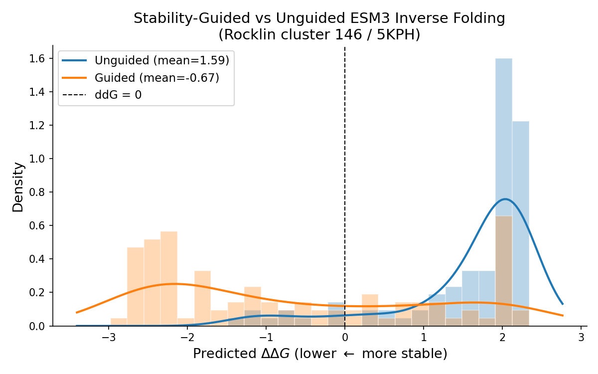
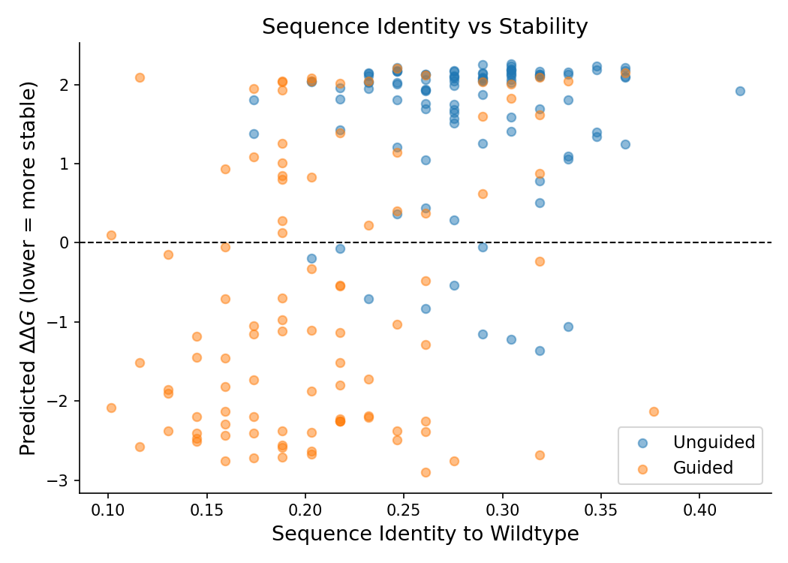

# Stability-Guided Inverse Folding

Generate thermodynamically stable protein sequences for a target backbone structure by combining ESM3 (inverse folding) with a structure-aware stability predictor via TAG guidance.

This workflow walks through `examples/stability_guidance/main.py`, which redesigns the Rocklin cluster 146 topology (PDB: 5KPH) — a small 4-helix bundle — and shows that guided sampling shifts the predicted ΔΔG distribution from destabilizing to stabilizing.

---

## What you need

| Component | Role | Source |
|-----------|------|--------|
| **ESM3** | Generative model — predicts sequence from structure | `proteingen.models.esm.ESM3` |
| **Noisy stability classifier** | Guides sampling toward stable sequences | `PreTrainedStabilityPredictor` with pretrained weights |
| **Stability oracle** | Evaluates final sequences (not used during sampling) | Raw `StabilityPMPNN` regression model |
| **Target backbone** | Structure conditioning input | PDB file (5KPH) |

The noisy classifier is a ProteinMPNN-based binary stability predictor trained on partially masked inputs so it produces useful gradients at intermediate denoising steps. The oracle is a separate regression model used only for evaluation.

---

## Pipeline

### 1. Load models

```python
from proteingen.models.esm import ESM3
from proteingen.models.rocklin_ddg.stability_predictor import (
    PreTrainedStabilityPredictor,
    StabilityPMPNN,
)

esm_model = ESM3().to(device)
esm_model.set_temp_(1.0)

# Noisy classifier for guidance
classifier = PreTrainedStabilityPredictor(
    classifier_path, one_hot_encode_input=True
).to(device).eval()

# Oracle for evaluation only
oracle_model = StabilityPMPNN.init(num_letters=21, vocab=21)
oracle_model.load_state_dict(torch.load(oracle_path, weights_only=False))
oracle_model = oracle_model.to(device).eval()
```

### 2. Set up structure conditioning

Both models need structure information, but in different formats:

```python
from proteingen.models.utils import pdb_to_atom37_and_seq

# ESM3 uses atom37 coordinates → VQ-VAE structure tokens
coords_RAX, wt_seq = pdb_to_atom37_and_seq(pdb_path, backbone_only=True)
esm_model.set_condition_({"coords_RAX": coords_RAX})

# Stability classifier uses PMPNN featurization
stability_cond = PreTrainedStabilityPredictor.prepare_conditioning(
    pdb_path, device=device
)
classifier.set_condition_(stability_cond)
classifier.set_temp_(0.03)  # lower = stronger guidance
```

`set_condition_()` on ESM3 runs the VQ-VAE structure encoder once (expensive) and caches the result. All subsequent forward passes reuse the cached tokens.

### 3. Sample — unguided vs. guided

```python
from proteingen.sampling import sample_linear_interpolation
from proteingen.guide import TAG

# Fully masked starting point
init_tokens = tokenizer(["<mask>" * len(wt_seq)])["input_ids"].to(device)

# Unguided: ESM3 inverse folding alone
unguided_seqs = sample_linear_interpolation(
    esm_model, init_tokens.expand(100, -1),
    n_steps=100, return_string=True,
)

# Guided: TAG combines ESM3 + stability classifier
guided_model = TAG(
    esm_model, classifier, use_clean_classifier=False,
).to(device)

guided_seqs = sample_linear_interpolation(
    guided_model, init_tokens.expand(100, -1),
    n_steps=100, return_string=True,
)
```

`use_clean_classifier=False` means the classifier sees the partially masked sequence as-is during sampling, rather than having mask positions filled with the generator's argmax first. This is appropriate here because the classifier was specifically trained on noisy (masked) inputs.

### 4. Evaluate with the oracle

```python
from proteingen.models.rocklin_ddg.data_utils import compute_seq_id

# ddG relative to wildtype (lower = more stable)
unguided_preds = predict_stability_raw(oracle_model, unguided_seqs, stability_cond, device)
wt_pred = predict_stability_raw(oracle_model, [wt_seq], stability_cond, device)

unguided_ddg = -1.0 * (unguided_preds - wt_pred[0])

# Sequence identity to wildtype
seq_ids = [compute_seq_id(s, wt_seq) for s in unguided_seqs]
```

The sign flip (`-1.0 *`) follows the convention where lower ΔΔG = more stable.

---

## Results

100 samples each, 100 denoising steps, `gen_temp=1.0`, `guide_temp=0.03`.

| Metric | Unguided | Guided |
|--------|----------|--------|
| Mean ΔΔG | +1.59 | **−0.67** |
| Fraction ΔΔG ≤ 0 | ~15% | **~65%** |
| Mean seq identity to WT | ~0.25 | ~0.20 |

Guidance shifts the distribution from mostly destabilizing (+1.59 mean) to mostly stabilizing (−0.67 mean). Guided sequences are slightly more diverse (lower wildtype identity), suggesting the classifier steers toward novel stabilizing solutions rather than just recovering the wildtype.

### ΔΔG distribution



### Sequence identity vs. stability



Guided sequences (orange) cluster in the lower half of the plot across all identity levels, while unguided sequences (blue) pile up in the destabilizing region around ΔΔG ≈ +2. There's no strong correlation between identity and stability — guidance finds stabilizing mutations at both high and low divergence from the wildtype.

---

## Key parameters

**`guide_temp`** (classifier temperature) is the most impactful knob. Lower values produce stronger guidance:

- `0.03` — moderate guidance, good diversity (used above)
- `0.01` — strong guidance, more biased toward stability
- `0.1+` — weak guidance, approaches unguided behavior

**`gen_temp`** (generator temperature) controls how peaked the ESM3 predictions are. At `1.0` (default), ESM3's confident positions (conserved residues) are hard to override. Raising to 2–3 flattens the prior, giving guidance more room to act.

**`n_steps`** — 100 steps (matching `dt=0.01`) works well. Fewer steps are faster but noisier.

See [ProteinGuide → Temperature tuning](protein-guide.md#temperature-tuning) for more on the interplay between these parameters.

---

## Running the example

```bash
uv run python examples/stability_guidance/main.py
```

Requires a GPU with ~24 GB memory (ESM3 + classifier + oracle). Outputs are saved to `examples/stability_guidance/outputs/`.

The example also includes `compare_legacy_sampler.py`, which runs a head-to-head comparison between the `sample_linear_interpolation` sampler and the legacy flow-matching rate sampler to verify they produce equivalent results.
